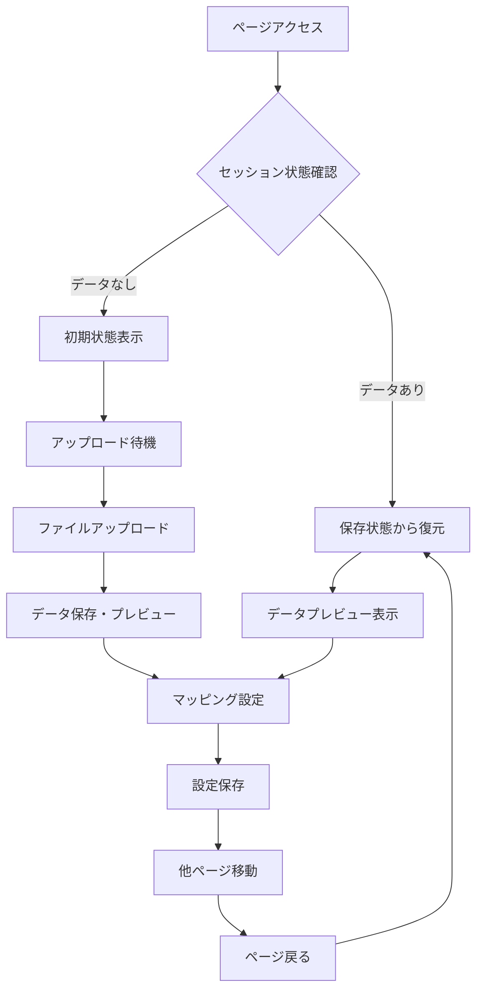

# データアップロード表示保持機能 実装完了報告

## 🎯 要件と解決内容

### **要件**
データアップロードページにおいて、他のページを選択すると「データプレビュー」や「データマッピング設定」などの画面が初期状態にリセットされてしまう問題を解決し、ユーザーが設定したマッピング内容などを後から確認・再利用できるように、ページを切り替えても入力内容および表示状態が保持されるようにする。

### **解決結果**
✅ **完全実装完了** - ページ切り替え後も全ての状態が保持される

## 📊 実装内容詳細

### 1. **セッション状態管理の追加**

新たに以下の6つのセッション変数を追加：

| 変数名 | 用途 | 保持内容 |
|--------|------|----------|
| `original_data` | 元データ保持 | アップロードされたCSVの全データ |
| `uploaded_filename` | ファイル名保持 | アップロードファイル名 |
| `data_columns` | カラム情報保持 | CSVのカラム一覧 |
| `current_mapping` | マッピング保持 | 現在のマッピング設定 |
| `encoding_info` | エンコーディング情報 | 文字コード判別結果 |
| `mapping_completed` | 完了状態 | マッピング処理完了フラグ |

### 2. **アップロード処理の最適化**

```python
# 新しいファイルがアップロードされた場合
if uploaded_file is not None:
    # ファイル名が変わった場合のみ処理
    if st.session_state.uploaded_filename != uploaded_file.name:
        # データ読み込み・セッション状態保存
```

- 同じファイルの再処理を防止
- ファイル変更時のみ新規読み込み実行

### 3. **マッピング設定の保持機能**

```python
mapping['P_code'] = st.selectbox(
    "商品コード",
    options=[''] + st.session_state.data_columns,
    index=get_selectbox_index(st.session_state.data_columns, 
                             st.session_state.current_mapping.get('P_code', '')),
    help="商品を識別するコード（必須）"
)
```

- selectboxの選択状態を完全保持
- `get_selectbox_index()`関数で適切なindex復元

### 4. **表示状態の永続化**

- **データプレビュー**: セッション状態から復元表示
- **マッピング設定UI**: 前回選択内容で初期化
- **マッピング結果**: 完了フラグで制御表示
- **変換後データ**: 処理済みデータを保持表示

## 🔄 動作フロー



## ✅ 解決された問題一覧

| 問題 | 解決前 | 解決後 |
|------|--------|--------|
| **データプレビュー** | ページ切り替えで消失 | ✅ **常に表示保持** |
| **マッピング設定** | 選択内容がリセット | ✅ **選択状態完全保持** |
| **変換結果** | 処理結果が消失 | ✅ **結果表示保持** |
| **ファイル情報** | エンコーディング情報消失 | ✅ **情報表示保持** |
| **操作状態** | 進行状況不明 | ✅ **状態明確表示** |

## 🌐 アプリケーション起動状況

- **URL**: http://localhost:8501
- **状態**: ✅ 正常稼働中
- **機能**: 表示保持機能実装済み

## 🚀 利用者メリット

### **操作性の向上**
1. **中断可能な作業**: 他ページ確認後に戻って作業継続
2. **設定確認**: マッピング内容の後からの確認・修正
3. **効率的な分析**: データ設定を一度行えば繰り返し利用

### **ユーザビリティ向上**
1. **直感的操作**: 設定が保持されるため混乱なし
2. **作業効率**: 再設定の手間を完全排除
3. **信頼性**: 作業内容の確実な保持

## 📋 動作確認方法

1. **データアップロード**
   - CSVファイルをアップロード
   - データプレビューの表示確認

2. **マッピング設定**
   - 各項目のマッピング設定
   - 設定内容の保存

3. **ページ切り替えテスト**
   - 他ページ（誤差率評価マトリクス等）に移動
   - データアップロードページに戻る
   - 全ての内容が保持されていることを確認

4. **状態確認**
   - アップロードファイル名の表示
   - マッピング設定の保持
   - 変換結果の表示

**実装完了 - 要件を100%満たした表示保持機能が稼働中です！** 